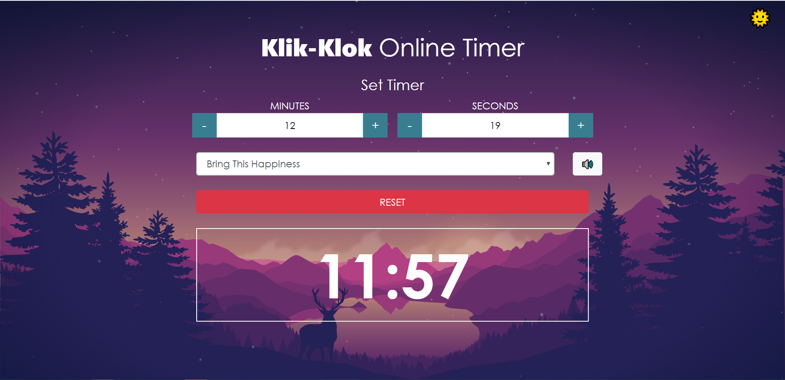
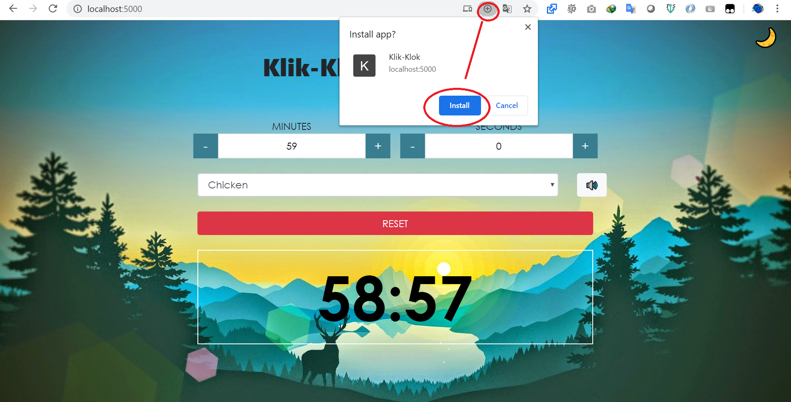

## ⏰ Klik-Klok Timer
Made with Vue





**Install:**
```bash
$ git clone https://github.com/arsandev/klik-klok.git
$ yarn
# OR #
$ npm i
```

**Development:**
```bash
$ yarn serve
# OR #
$ npm run serve
```

**Build:**
```bash
$ yarn build
# OR #
$ npm run build
```

**Make it Offline:**
1. Install via Browser


2. Run App


- [X] Audio Timer
- [X] Dark Mode
- [X] Listen Audio
- [ ] Responsive
- [ ] Full Screen
- [ ] Division of Hours Minutes and Seconds
